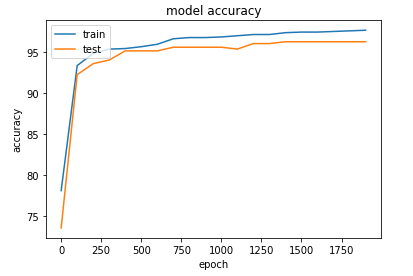
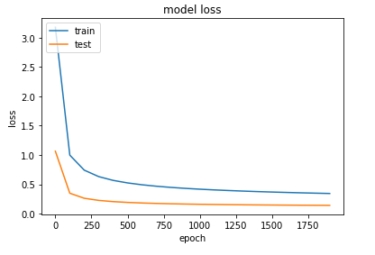

# Logistic Regression Implementation - from scratch !

This is a Logistic Regression model implementation, which was inspired by the "Neural Networks and Deep Learning" course, hosted on coursera, and offered by Deeplearning.ai, which I like to thank for their great informative content that helped solidify my knowledge in this field.

In this implementation, I've build the general architecture of a learning algorithm, according to the logistic regression function, including:
Initializing parameters.
  - Calculating the cost function and its gradient.
  - Providing a method for Calculating the accuracy and loss metrics, when verbosity is on.
  - Using an optimization algorithm (gradient descent) for the back propagation.
  - Vectorized Calculations for optimizing the execution time.
  - A demo for showing how it works !
  
Of course this implementation has room to improve, and I'm looking forward to do it !  
_Note : This implementation was made for learning purposes, it's not meant to be used in a real-world application, at least for the moment!_

# This is basically how you could use it

```python3

  from logistic_regression import LogisticRegression
  logreg = LogisticRegression(learning_rate = 0.002, loss='categorical_crossentropy')
  history = logreg.fit(x_train, y_train, x_test, y_test, epochs=2000, verbose=100, metrics=['accuracy', 'loss'])
```

# Here's also a snippet of it's performance 




